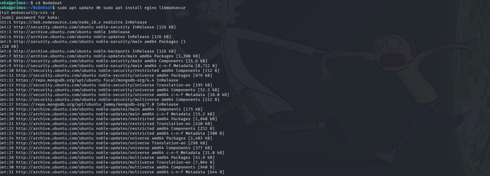

# Defensive Phase (Blue Team - Defensive Security Framework)

## Stage 1: Preparation (Hardening)
**Objective: To proactively secure the system.**
- Deploy a Web Application Firewall (WAF):
- Install Nginx & ModSecurity (on the Ubuntu server):
- sudo apt update && sudo apt install nginx libmodsecurity3 modsecurity-crs -y

- Configure Nginx as a Reverse Proxy: Edit /etc/nginx/sites-available/default to forward traffic from port 80 to the app on port 4000 and enable ModSecurity.
- Enable Blocking Mode: In /etc/modsecurity/modsecurity.conf, change SecRuleEngine DetectionOnly to SecRuleEngine On.

## Stage 2 & 3: Detection & Analysis
**Objective: To monitor logs to detect and analyze attacks.**
- Implement Centralized Logging: Install an agent like Filebeat to ship Nginx and application logs to a SIEM platform.
- Analyze Logs: In the SIEM, the Blue Team would analyze logs for patterns:
- IDOR: Look for a single IP accessing many sequential /allocations/ IDs.
- Common Web Attacks: ModSecurity logs will show blocked NoSQL/XSS attempts.

## Stage 4: Containment
**Objective: To limit the attacker's ability to exploit the vulnerability and prevent further data exposure while a permanent fix is being developed.**
- Deploy a Custom WAF Rule (Virtual Patching): While waiting for a permanent code fix, a security analyst can write a specific rule for the WAF to surgically block the IDOR attack pattern. This rule would detect and block any session that attempts to access more than a few unique /allocations/:id URLs within a short time frame. This is a form of "virtual patching."
- Force Session Invalidation: For the user accounts that were identified as being illegitimately accessed (e.g., the admin account), their active sessions can be immediately terminated from the server-side. This revokes the attacker's current access through those accounts and forces them to re-authenticate, which they cannot do without credentials

## Stage 5: Eradication
**Objective: To fix the root cause of the vulnerabilities.**
- IDOR Code Fix: Developers must modify the /allocations/:id endpoint to check if the session's user_id matches the owner of the requested allocation id. If not, deny access.

- CSRF Code Fix: Implement the Synchronizer Token Pattern. Generate a unique, random anti-CSRF token per session, embed it in forms, and validate it on the server upon submission.

- Vulnerable Components Fix: Run npm audit fix and manually update remaining outdated libraries in package.json to the latest stable versions.

## Stage 6 & 7: Recovery & Lessons Learned
**Objective: To return to normal operations and improve security going forward.**
- Deploy Patched Code: Release the fixed version of the application.
- Re-test: The pentester must verify that all vulnerabilities have been closed.
- Lessons Learned: Document the incident. Update policies to mandate security code reviews and automated dependency scanning in the development pipeline.
