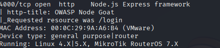
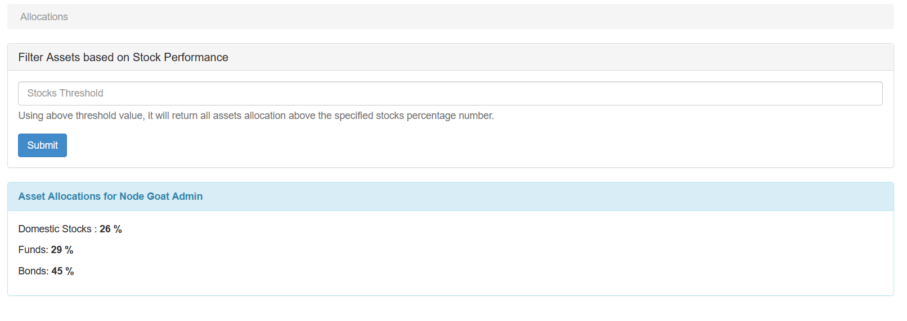
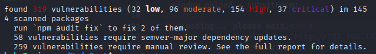
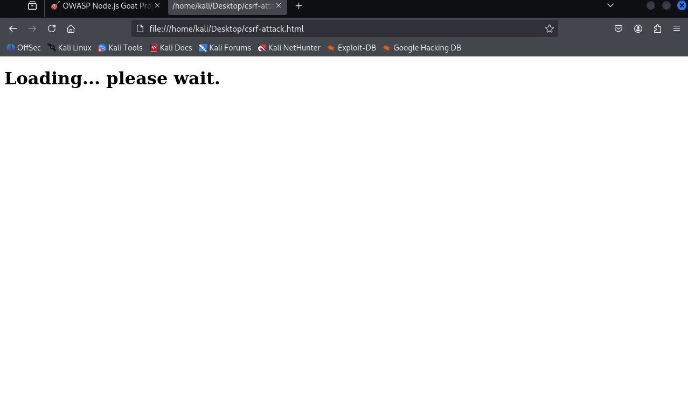
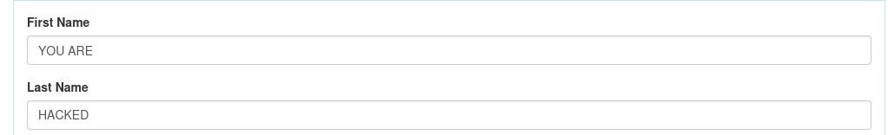
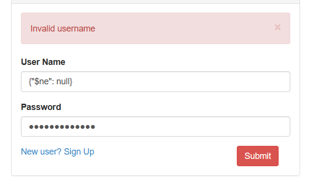
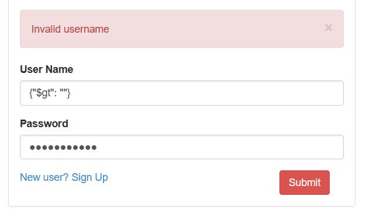
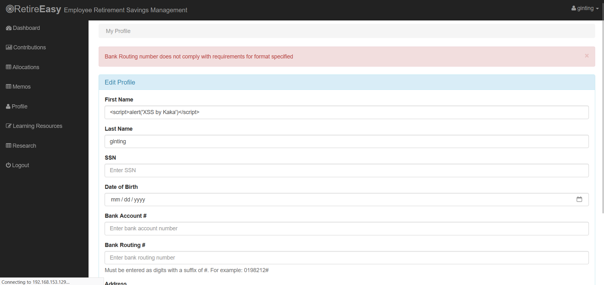
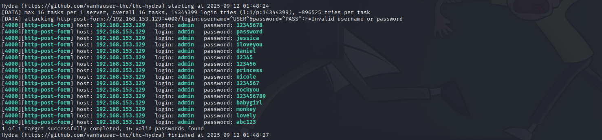

# Offensive Phase (Red Team - Penetration Testing Framework)

## Stage 1: Pre-engagement / Preparation
**Objective: To formally define the scope and rules of engagement.**
- Scope: The Nodegoat web application running at 192.168.153.129:4000.
- Rules of Engagement: All testing is confined to the defined scope. No DoS attacks.
- Legal: In a real-world scenario, this stage involves legal contracts and written permissions.

## Stage 2: Reconnaissance, Scanning & Enumeration
**Objective: To gather technical intelligence about the target to identify potential entry points.**
- Execute Nmap Scan (from Kali Linux):
- sudo nmap -sS -A -T4 192.168.153.129
- Analyze Results:

- Port 4000 (HTTP): Identified as a Node.js Express application with the title OWASP Node Goat. This is our primary target.
- Port 80 (HTTP): Default Apache web server. Not relevant.
- Port 22 (SSH): Remote access service. A potential vector if weak credentials are in use.
- OS: Identified as Linux.

## Stage 3: Vulnerability Analysis
**Objective: To analyze the scan results and form attack hypotheses.**
- Hypothesis 1 (Successful - IDOR): The /allocations/:id endpoint is vulnerable to Insecure Direct Object Reference due to its use of a numeric ID in the URL.
- Hypothesis 2 (Successful - Vulnerable Components): The project uses outdated Node.js libraries, likely containing numerous publicly known vulnerabilities (CVEs).
- Hypothesis 3 (Successful - CSRF): State-changing forms (like user profile) may lack effective Anti-CSRF token protection.
- Hypothesis 4 (Failed - Good Defenses): The application may have defenses against common attacks like NoSQL Injection, XSS, and Brute Force.

## Stage 4: Exploitation (Gaining Access)
**Objective: To actively test the hypotheses.**
Finding #1: IDOR (Insecure Direct Object Reference) - CRITICAL
- Create Two Accounts: Create user-A (e.g., primus ginting) and user-B (e.g., attacker).
- Log in as user-A: Visit the "Allocations" page and note the URL (e.g., .../allocations/4).
- Log in as user-B: Manually browse directly to user-A's URL (http://192.168.153.129:4000/allocations/4).
- Result: user-B successfully viewed the sensitive financial allocation data of user-A and the admin, confirming a critical IDOR vulnerability.

Finding #2: Vulnerable and Outdated Components - CRITICAL
- Access the Ubuntu Server (via SSH):
- ssh kaka@192.168.153.129
- Run npm audit:
- cd ~/NodeGoat
- nvm use 10
- npm audit
- Result: The scan found 319 vulnerabilities, including 37 Critical and 154 High in libraries like mongodb, marked, and minimist. This proves significant security risk from outdated dependencies.

Finding #3: CSRF (Cross-Site Request Forgery) - HIGH
- Analysis: The profile form's _csrf input was found to have an empty value, indicating ineffective protection.
- Create Malicious Page: An csrf-attack.html file was created with a hidden form to change the victim's last name to "HACKED".
- Run Attacker Server (on Kali):
- cd ~/Desktop
- python3 -m http.server 8080
- Simulation: A victim, logged into Nodegoat (Tab 1), is lured into visiting the attacker's page http://localhost:8080/csrf-attack.html (Tab 2).
- Result: The victim's last name on their Nodegoat profile was successfully changed without their knowledge, confirming the CSRF vulnerability.

**Analysis of Security Controls (Effective Defenses)**
- NoSQL Injection & XSS: Failed. The application proved to have effective input sanitization and output encoding.

- Brute Force: Failed. The application proved to have an effective rate-limiting mechanism against automated tools like Hydra.

## Stage 5: Post-Exploitation
**Objective: To gather evidence and determine the impact.**
- Impact: The IDOR vulnerability could lead to a full data breach of all users' financial data. The vulnerable components could be exploited for server takeover.
- Evidence (Capture The Flag): Screenshots of the admin's allocation page, the npm audit report, and the profile modified by the CSRF attack.

## Stage 6: Reporting
**Objective: To formally document all findings.**
- The report must include a summary, technical details of all findings (both successful exploits and effective defenses), risk ratings (IDOR and Vulnerable Components are Critical), and a remediation plan.
