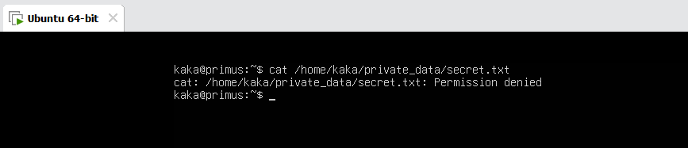
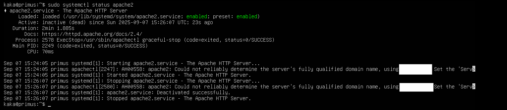
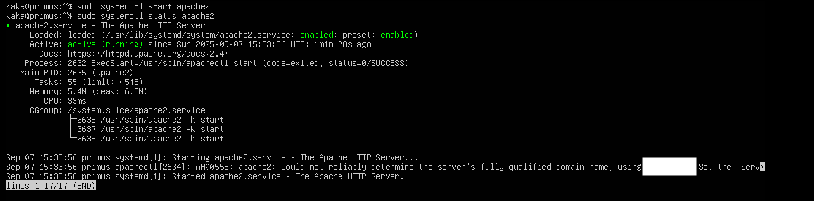

# Linux Troubleshooting (Ubuntu Server)

## Case 1: File Permission Denied
**Problem:**  
A user could not access a file, showing "Permission denied".

**Solution:**  
- Checked file permissions using `ls -l`.
  
- Modified permissions with `chmod 644 <filename>`.  
- Verified access using `cat <filename>`.  

**Outcome:**  
The file became accessible again with proper permissions.  

---

## Case 2: Web Service Down (Apache)
**Problem:**  
The hosted website was not accessible because the Apache service was stopped.

**Solution:**  
- Checked service status with `systemctl status apache2`.  

- Inspected logs using `journalctl -u apache2`.  

- Restarted service with `systemctl start apache2`.  

- Verified configuration with `apache2ctl configtest`.  

**Outcome:**  
Apache service was restored, and the website became accessible.  

