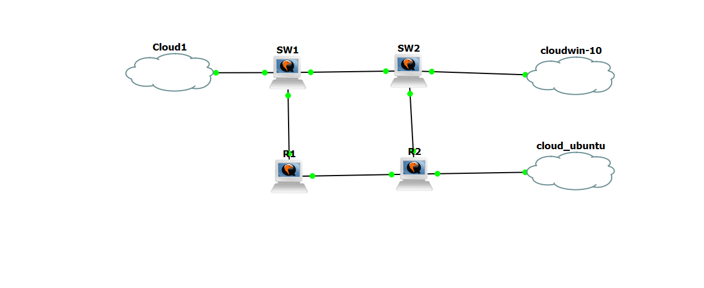
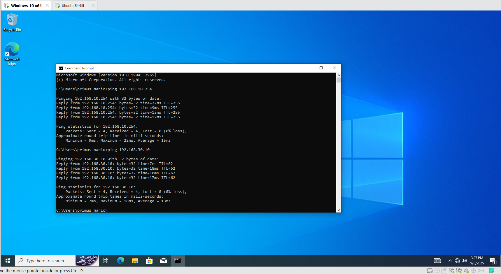
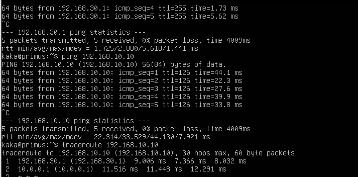
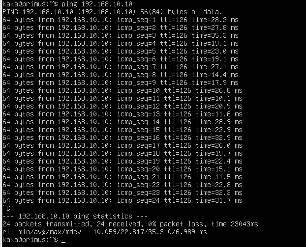

# Network Infrastructure (Cisco GNS3)

## Case 1: VLAN Segmentation
**Problem:**  
Hosts across departments could not communicate because VLANs were not configured.



**Solution:**  
- Created VLAN 10 (IT) and VLAN 20 (HR) on the switch. 
 ```bash
        SW1(config)#vlan 10
        SW1(config-vlan)#name IT_Dept
        SW1(config-vlan)#vlan 20
        SW1(config-vlan)#name HR_Dept
        SW1(config-vlan)#exit
 ```

- Configured trunk ports between switches.  
 ```bash
        SW1(config)#interface FastEthernet0/2 
        SW1(config-if)#switchport mode trunk
        SW1(config-if)#switchport trunk encapsulation dot1q 
        SW1(config-if)#exit
```

- Enabled Router-on-a-Stick on the router.  
```bash
        R1(config)#interface FastEthernet0/0.10 
        R1(config-subif)#encapsulation dot1Q 10
        R1(config-subif)#ip address 192.168.10.254 255.255.255.0 
        R1(config-subif)#exit

        R1(config)#interface FastEthernet0/0.20 
        R1(config-subif)#encapsulation dot1Q 20
        R1(config-subif)#ip address 192.168.20.254 255.255.255.0 
        R1(config-subif)#exit
 ```
    
- Assigned interfaces to their respective VLANs.  
```bash
        SW2(config)#vlan 10
        SW2(config-vlan)#name IT_Dept
        SW2(config-vlan)#vlan 30
        SW2(config-vlan)#name Ubuntu_Net
        SW2(config-vlan)#exit

        SW2(config)#interface FastEthernet0/0   # Port to SW1
        SW2(config-if)#switchport mode trunk
        SW2(config-if)#switchport trunk encapsulation dot1q
        SW2(config-if)#exit

        SW2(config)#interface FastEthernet0/2   # Port to Cloud-Win10 (Windows VM)
        SW2(config-if)#switchport mode access
        SW2(config-if)#switchport access vlan 10
        SW2(config-if)#exit

        SW2(config)#interface FastEthernet0/3   # Port to Cloud-Ubuntu (Ubuntu VM)
        SW2(config-if)#switchport mode access
        SW2(config-if)#switchport access vlan 30
        W2(config-if)#exit
```

**Outcome:**  
Hosts within the same VLAN communicated successfully, and inter-VLAN communication worked via the router.  



---

## Case 2: Routing Between Networks
**Problem:**  
Hosts on different networks could not ping each other because no routing was configured.

**Solution:**  
- Enabled OSPF on R1 and R2.  
```bash
        R1(config)#router ospf 1
        R1(config-router)#network 192.168.10.0 0.0.0.255 area 0
        R1(config-router)#network 192.168.20.0 0.0.0.255 area 0
        R1(config-router)#network 10.0.0.0 0.0.0.3 area 0
        R1(config-router)#exit

        R2(config)#router ospf 1
        R2(config-router)#network 192.168.30.0 0.0.0.255 area 0
        R2(config-router)#network 192.168.40.0 0.0.0.255 area 0
        R2(config-router)#network 10.0.0.0 0.0.0.3 area 0
        R2(config-router)#exit
```
- Advertised networks into area 0.  
- Verified routing with `show ip route` and `show ip ospf neighbor`.  
```bash
        R1#show ip route ospf
        R1#show ip ospf neighbor
        R2#show ip route ospf
        R2#show ip ospf neighbor
```
- Tested connectivity with `ping` and `traceroute`.  



**Outcome:**  
Routing was established, and hosts across different VLANs/networks could communicate.  


