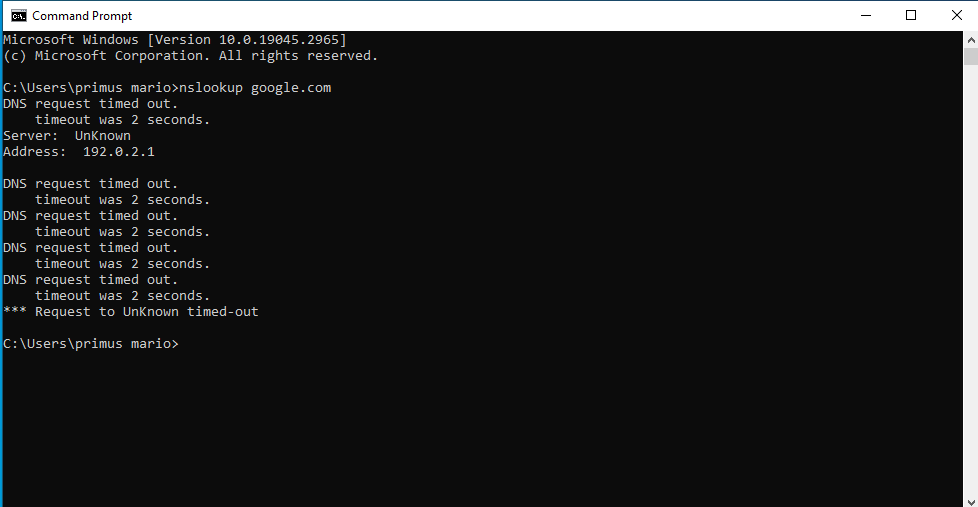
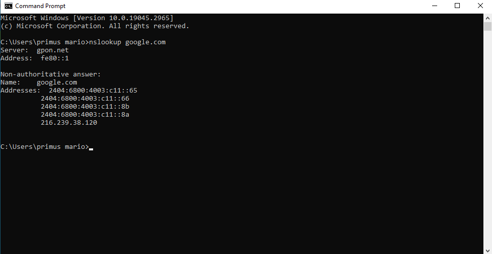
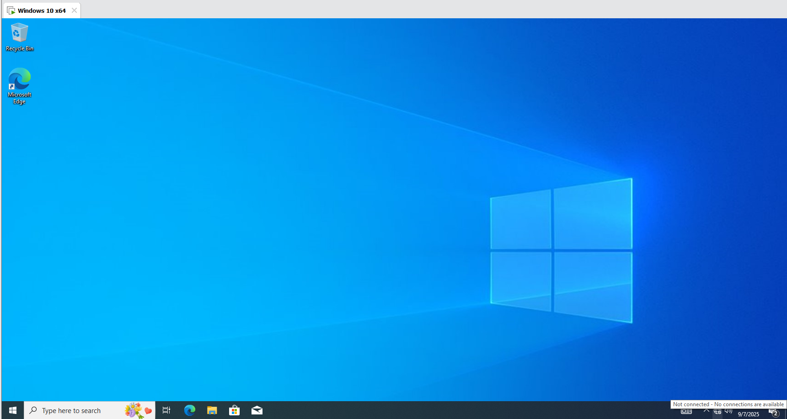
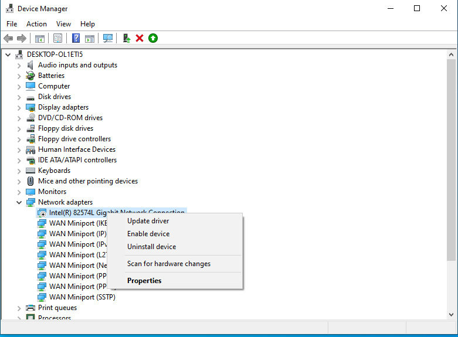
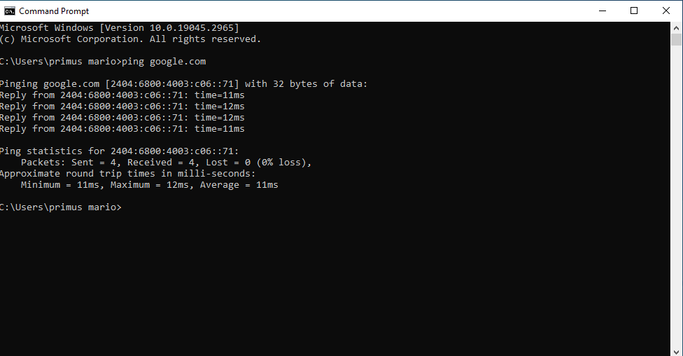

# Windows Troubleshooting

## Case 1: DNS Resolution Failure
**Problem:**  
The system could not access websites, and pinging hostnames such as `google.com` failed.

**Solution:**  
- Checked IP configuration with `ipconfig /all`.  
- Flushed DNS cache using `ipconfig /flushdns`.  
- Reconfigured DNS server to Google DNS (8.8.8.8 / 8.8.4.4).  
- Verified connectivity with `ping google.com`.  

**Outcome:**  
Hostname resolution was restored and internet connection returned to normal.  

---

## Case 2: Network Adapter Disabled
**Problem:**  
The PC could not connect to the network, with the network icon showing "No Internet".

**Solution:**  
- Checked adapter status in Device Manager.  
- Re-enabled the network driver. 
 
- If faulty, reinstalled the driver from vendor.  
- Verified connectivity with `ping google.com`.  

**Outcome:**  
Internet connection was restored after re-enabling the adapter.  

